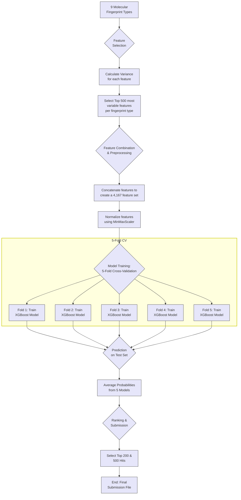
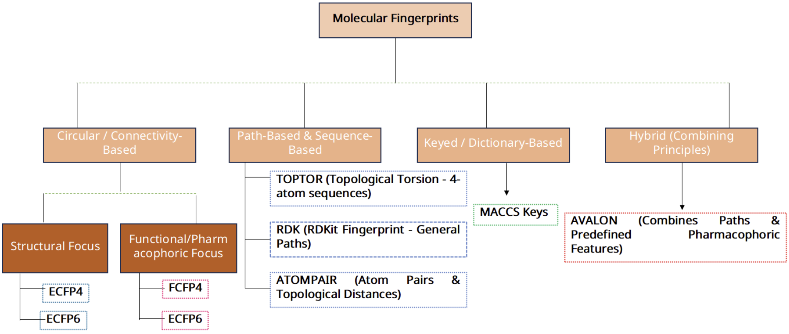
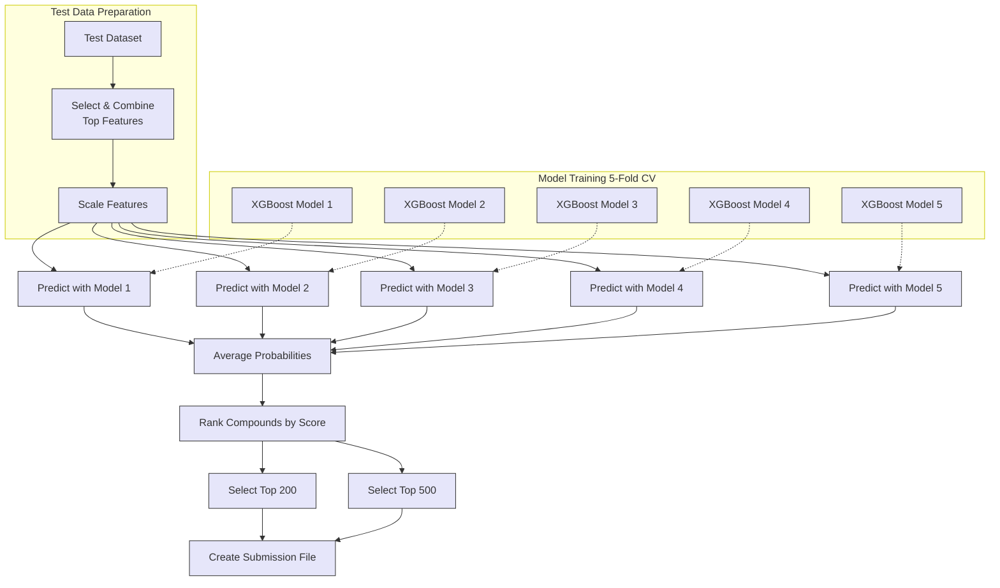

# DREAM CHALLENGE: TARGET 2035

## STEP 1: Weighted machine learning with highly variable fingerprints to predict WDR91 hits

Gautam Ahuja^*,1,2,3,4^,  Rik Ganguly^*,3,4^, Zonunmawia^2,4,5^, Bableen Kaur^2,4^,  Sagarika Toor^4,6^, Vinita Sharma^4,6^, Aakansha Rai^2^, Rintu Kutum^1,2,3,4,7,#^

[1] Department of Computer Science, Ashoka University, India
[2] Koita Centre for Digital Health at Ashoka (KCDH-A), Ashoka University, India
[3] Mphasis AI & Applied Tech Lab at Ashoka, Ashoka University, India
[4] Augmented Health Systems Laboratory, Ashoka University, India
[5] Department of Computer Science, International University of Applied Sciences, Bad Honnef, Germany
[6] Department of Biology, Ashoka University, India
[7] Trivedi School of Biosciences, Ashoka University, India  

[*] Equal contribution
[#] Correspondance: rintu.kutum@ashoka.edu.in, rintu.kutum@augmented-health-systems.org

## Summary 
In this work, we developed a weighted ensemble machine learning pipeline to predict compound hits against the `WDR91` target using heterogeneous molecular fingerprints. Starting from nine distinct fingerprint representations (ATOMPAIR, AVALON, RDKit, ECFP4, ECFP6, FCFP4, FCFP6, MACCS), we applied a variance-based feature selection strategy to retain only the most informative (top 500) dimensions across fingerprints. The selected features were concatenated into a single, high-dimensional descriptor space and scaled using `MinMax` normalization between 0 and 1.

To address severe class imbalance between "hit" and "non-hit" compounds, we trained a weighted `XGBoost` classifier with `scale_pos_weight` set to the ratio of negative to positive samples (`12.05`). A 5-fold cross-validation training regime was used both for model assessment and to construct an ensemble of five models. Final test-set scores were obtained by averaging predicted hit probabilities across the five folds, and compounds were ranked to generate Top-200 and Top-500 hit lists for submission. Our approach achieved an average cross-validation training accuracy of ~97.5%, with a precision of 0.84, recall of 0.83, and F1-score of 0.84 on the minority hit class.

## Methods

We developed a machine learning pipeline to predict WDR91 hits. The process involved feature selection, model training, and evaluation using a cross-validation approach Below is a flowchart illustrating our machine learning pipeline.

### Data and Molecular Fingerprints

A training set of 375,595 compounds with binary labels (Hit = 28,778; Non-hit = 346,817). An unlabelled test set of 339,257 compounds for which participants were required to predict hit probabilities.

For each compound, nine distinct molecular fingerprint types were supplied. These belonged to a broader category of the following:

Each fingerprint type captures different aspects of molecular structure and properties. Below is a summary of the fingerprint types used, along with their characteristics:

| **Fingerprint** | **Determines/Represents** | **File Type** | **File Dimension** |
| :--- | :--- | :--- | :--- |
| **ECFP4** | Extended Connectivity Fingerprints (ECFPs) encode circular atom neighborhoods. ECFP4 considers features up to a diameter of 4 bonds. It captures detailed structural information about molecular fragments [1]. | Non-Binary | 2048 |
| **ECFP6** | Similar to ECFP4, but considers features up to a diameter of 6 bonds. This allows for the representation of larger and more complex structural motifs [1]. | Non-Binary | 2048 |
| **FCFP4** | Functional-Class Fingerprints (FCFPs) are a variation of ECFPs. Instead of atom types, they use pharmacophoric features (e.g., H-bond donor/acceptor, aromatic). FCFP4 considers features up to a diameter of 4 bonds [2]. | Non-Binary | 2048 |
| **FCFP6** | Similar to FCFP4, but considers pharmacophoric features up to a diameter of 6 bonds, capturing larger functional patterns [2]. | Non-Binary | 2048 |
| **AVALON** | The AVALON fingerprint encodes structural and pharmacophoric features. It enumerates paths and feature classes (e.g., H-bond donor/acceptor, ring systems) and hashes them into a bit string [3]. | Non-Binary | 2048 |
| **RDK** | The RDKit fingerprint is a Daylight-like fingerprint. It identifies all subgraphs in the molecule within a particular size range, hashes each subgraph to a raw bit, and then ORs these bits into a fingerprint of a fixed size. | Binary | 2048 |
| **TOPTOR** | Topological Torsion fingerprints encode information about sequences of four consecutively bonded atoms (torsions). They capture 3D conformational aspects in a 2D representation by considering atom types and bond properties along these torsions. | Non-Binary | 2048 |
| **ATOMPAIR** | Atom-Pair fingerprints encode pairs of atoms and the distance (number of bonds) separating them. They capture information about the presence of specific atom pairs at various topological distances. | Non-Binary | 2048 |
| **MACCS** | MACCS (Molecular ACCess System) keys, also known as MDL public keys, are a set of 166 predefined structural fragments or features. Each bit indicates the presence or absence of a specific key [4]. | Binary | 167 |

For analysis, each fingerprint type was treated as an independent feature block, with its own dimensionality and value distributions.

### Feature Processing and Model Training

1. **Feature Selection**: We started with nine different types of molecular fingerprints. To reduce dimensionality and select the most informative features, we employed a variance-based feature selection method. For each of the 9 fingerprint types, we calculated the variance of every feature across the entire training dataset. We then selected the top 500 features with the highest variance from each fingerprint type with the hypothesis that variable features are more likely to contribute to discrimination between hits and non-hits.

2. **Feature Combination and Preprocessing**: The selected 500 features from each of the 9 fingerprint types were concatenated to form a combined feature set of 4,167 features for each molecule. To ensure that features with larger value ranges do not dominate the model, we normalized the combined feature matrix using `MinMaxScaler`, scaling all feature values to a range between 0 and 1.

3. **Model Training**: We chose the XGBoost (Extreme Gradient Boosting) [5] algorithm for our classification task due to its strong performance on tabular and high-dimensional data.
    * **Handling Class Imbalance**: The training data was highly imbalanced. To address this, we used the `scale_pos_weight` parameter in the XGBoost classifier, setting it to the ratio of the number of negative samples to positive samples (346817/28778 = 12.05). This gives a higher weight to the minority class (hits) during model training.
    * **Cross-Validation**: We implemented a 5-fold cross-validation strategy to build robust models and evaluate their performance. The training data was split into five folds. We trained five separate XGBoost models, where each model was trained on four folds and evaluated on the remaining one. Each model was configured with 2000 estimators (trees) and a random state of 42 for reproducibility.

#### Final model and prediction procedure

1. Estimate the variance for each feature within each of the 9 fingerprint types provided in the training data.
2. Select the top 500 most variable features from each fingerprint type and combine them into a single feature matrix.
3. Normalize the combined feature matrix using MinMaxScaler fitted on the training data.
4. Use a weighted XGBoost algorithm with a 5-fold cross-validation strategy to train five separate models on the combined, scaled features.
5. Generate predictions on the test set by averaging the probability scores from the five models.
6. Rank the compounds based on the averaged score to select the top 200 and 500 hits for the final submission.

The prediction process using the ensemble of 5 models is shown below:

## Results

The performance of our models was evaluated during the 5-fold cross-validation on the testing set and subsequently used to generate predictions on the held-out test set.

### Cross-Validation Performance
**Overall performance**: The models demonstrated consistent and high performance across all five folds, with an average accuracy of approximately 97.5% on the validation folds.

**Minority class (Hit, class 1) performance**: Given the strong class imbalance, we focused on class-specific metrics for the hit class:
- Mean precision: 0.84
- Mean recall: 0.83
- Mean F1-score: 0.84

### Final predictions and submission
For the final submission:
1. We applied the trained feature-selection and scaling pipelines to the test set to generate the 4,167-dimensional, normalized feature representation for each compound.
2. Each of the five XGBoost models produced a predicted probability of being a hit for every test compound.
3. We averaged the five probabilities to obtain a final ensemble score for each compound.

Compounds were then ranked in descending order of ensemble score:

- The `Sel_200` column was set to 1 for the top 200 compounds and 0 otherwise.
- The `Sel_500` column was set to 1 for the top 500 compounds and 0 otherwise.
- All compounds retained their continuous `Score` (averaged hit probability) to allow downstream threshold adjustment or enrichment analysis.

## Implementation details
All code for this work has been implemented in Python using the following libraries:
- `pandas` for data manipulation and analysis.
- `numpy` for numerical computations and array operations.
- `scikit-learn` for feature selection, normalization, and evaluation metrics.
- `xgboost` for implementing the XGBoost classifier.
- `scipy` for additional scientific computations.

## Discussion
In this work, we proposed a machine learning pipeline for predicting WDR91 hits in the DREAM TARGET 2035 challenge. By combining highly variable features from nine molecular fingerprint types with a weighted XGBoost classifier and 5-fold ensembling, we obtained strong cross-validation performance on a highly imbalanced classification problem.

- Leveraging multiple fingerprint types allowed us to capture diverse structural and chemical information about the compounds.
- Simple feature selection based on variance proved effective in reducing dimensionality while retaining informative features. 
- Handling class imbalance with instance weighting using `scale_pos_weight` improved minority class performance.

## References
1. Rogers, D., &; Hahn, M. (2010). Extended-connectivity fingerprints. Journal of chemical information and modeling, 50(5), 742-754.
2. Volynets, G. P., Usenko, M. O., Gudzera, O. I., Starosyla, S. A., Balanda, A. O., Syniugin, A. R., ... &; Tukalo, M. A. (2022). Identification of dual-targeted Mycobacterium tuberculosis aminoacyl-tRNA synthetase inhibitors using machine learning. Future Medicinal Chemistry, 14(17), 1223-1237.
3. Wellnitz, J., Ahmad, S., Begale, N., Joseph, J., Zeng, H., Bolotokova, A., ... &; Couñago, R. (2024). Enabling Open Machine Learning of DNA Encoded Library Selections to Accelerate the Discovery of Small Molecule Protein Binders.
4. Bixler, N. E., Walton, F., Leute, J. E., Eubanks, L. L., Haaker, R., &; McFadden, K. L. (2021). MACCS (MELCOR Accident Consequence Code System) User Guide (No. SAND-2021-1588). Sandia National Lab.(SNL-NM), Albuquerque, NM (United States).
5. Chen, Tianqi, et al. "Xgboost: extreme gradient boosting." R package version 0.4-2 1.4 (2015): 1-4.

## Authors Statement

### Author contributions

- Conceptualization: R.K., G.A., R.G.
- Methodology: G.A., R.G., Z., R.K.
- Software and implementation: G.A., R.G., Z.
- Data curation and preprocessing: B.K., S.T., V.S., A.R.
- Formal analysis: G.A., R.G., Z.
- Biological interpretation: S.T., V.S., A.R., R.K.
- Domain resources: R.G., S.T., V.S., A.R.
- Visualization: G.A.
- Validation: G.A., R.G., R.K.
- Writing - original draft: G.A., R.G., R.K.
- Writing - review & editing: All authors.
- Team administration and supervision: R.K.

G.A. and R.G. contributed equally to this work. 

The submission was done as a team to the DREAM Challenge: [KutumLab-T035](https://www.synapse.org/Team:3544729).

### Acknowledgments
R.K. would like to acknowledge the DREAM Challenge organizers for providing the opportunity and resources to participate in this challenge. R.K. would like to thank the support and resources provided by Ashoka University, the Koita Centre for Digital Health at Ashoka (KCDH-A), and the Mphasis AI & Applied Tech Lab at Ashoka University. 

### Competing interests
The authors declare no competing financial or non-financial interests.

### Data and code availability
The WDR91 training and test datasets were provided as part of the DREAM Challenge: [First DREAM Target 2035 Drug Discovery Challenge](https://www.synapse.org/Synapse:syn65660836/wiki/631410) and are subject to the challenge’s data usage policies. Code implementing the described pipeline (feature selection, model training, and prediction) are available on GitHub: [KutumLab/KutumLab-T035](https://github.com/KutumLab/KutumLab-T035).
