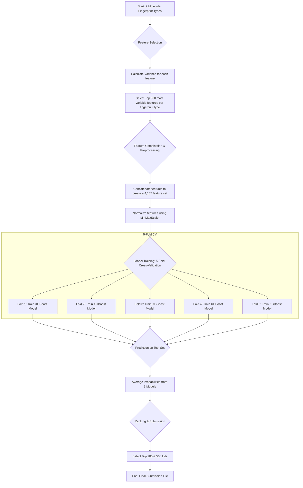
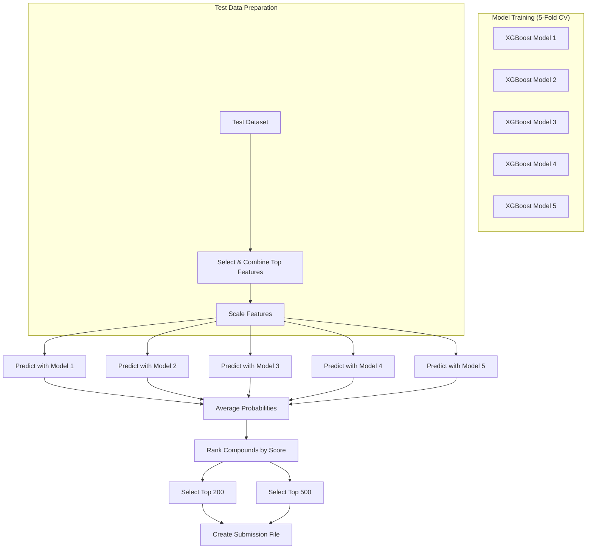

# DREAM CHALLENGE: TARGET 2035

## Weighted machine learning with highly variable fingerprints to predict WDR91 hits

[Authors]
[Step 1] Gautam Ahuja^*1,2^,  Rik Ganguly^*3^, Zonunmawia^2,4^, Bableen Kaur^2^,  Sagarika Toor^5^, Vinita Sharma^5^, Aakansha Rai^2^, Rintu Kutum^1,2,3,6,#^

[1] Department of Computer Science, Ashoka University
[2] Koita Centre for Digital Health - Ashoka (KCDH-A),  University
[3] Mphasis AI & Applied Tech Lab at Ashoka, Ashoka University
[4] International University of Applied Science, Bad Honnef, Germany
[5] Department of Biology, Ashoka University
[6] Trivedi School of Biosciences, Ashoka University  

[*] Equal contribution
[#] Corresponding author

## Methods

Below is a flowchart illustrating our machine learning pipeline.

We developed a machine learning pipeline to predict WDR91 hits. The process involved feature selection, model training, and evaluation using a cross-validation approach.

1. **Feature Selection**: We started with 9 different types of molecular fingerprints. To reduce dimensionality and select the most informative features, we employed a variance-based feature selection method. For each of the 9 fingerprint types, we calculated the variance of every feature across the entire training dataset. We then selected the top 500 features with the highest variance from each fingerprint type.

2. **Feature Combination and Preprocessing**: The selected 500 features from each of the 9 fingerprint types were concatenated to form a combined feature set of 4,167 features for each molecule. To ensure that features with larger value ranges do not dominate the model, we normalized the combined feature matrix using `MinMaxScaler`, scaling all feature values to a range between 0 and 1.

3. **Model Training**: We chose the XGBoost (Extreme Gradient Boosting) algorithm for our classification task due to its performance and efficiency.
    * **Handling Class Imbalance**: The training data was highly imbalanced. To address this, we used the `scale_pos_weight` parameter in the XGBoost classifier, setting it to the ratio of the number of negative samples to positive samples. This gives a higher weight to the minority class (hits) during model training.
    * **Cross-Validation**: We implemented a 5-fold cross-validation strategy to build robust models and evaluate their performance. The training data was split into five folds. We trained five separate XGBoost models, where each model was trained on four folds and evaluated on the remaining one. Each model was configured with 2000 estimators.

**[Final Model]**

1. Estimate the variance for each feature within each of the 9 fingerprint types provided in the training data.
2. Select the top 500 most variable features from each fingerprint type and combine them.
3. Use a weighted XGBoost algorithm with a 5-fold cross-validation strategy to train five separate models on the combined, scaled features.
4. Generate predictions on the test set by averaging the probability scores from the five models.
5. Rank the compounds based on the averaged score to select the top 200 and 500 hits for the final submission.

The prediction process using the ensemble of 5 models is shown below:

## Results

The performance of our models was evaluated during the 5-fold cross-validation.

* **Cross-Validation Performance**: The models demonstrated consistent and high performance across all five folds. The average overall accuracy was approximately 97.5%. For the minority class (class 1, "Hits"), the models achieved an average precision of 0.84 and a recall of 0.83, leading to an F1-score of 0.84. This indicates that the model is effective at identifying potential hits while maintaining a good precision rate.

* **Final Predictions**: For the final submission, predictions on the test set were made using all five models trained during cross-validation. The final "Score" for each compound was determined by averaging the predicted probabilities of being a "Hit" from all five models. The `Sel_200` and `Sel_500` columns were populated by selecting the compounds with the top 200 and 500 highest scores, respectively.
