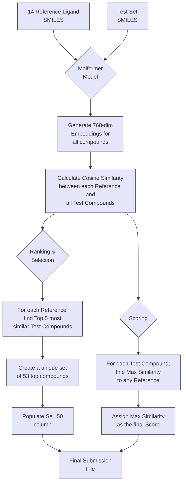

# DREAM CHALLENGE: TARGET 2035

## STEP 2: Ensemble Prediction and Embedding-based Closeness for WDR91 Hit Selection

Gautam Ahuja^*,1,2,3,4^,  Rik Ganguly^*,3,4^, Zonunmawia^2,4,5^, Bableen Kaur^2,4^,  Sagarika Toor^4,6^, Vinita Sharma^4,6^, Aakansha Rai^2^, Rintu Kutum^1,2,3,4,7,#^

[1] Department of Computer Science, Ashoka University, India
[2] Koita Centre for Digital Health at Ashoka (KCDH-A), Ashoka University, India
[3] Mphasis AI & Applied Tech Lab at Ashoka, Ashoka University, India
[4] Augmented Health Systems Laboratory, Ashoka University, India
[5] Department of Computer Science, International University of Applied Sciences, Bad Honnef, Germany
[6] Department of Biology, Ashoka University, India
[7] Trivedi School of Biosciences, Ashoka University, India  

[*] Equal contribution
[#] Correspondance: rintu.kutum@ashoka.edu.in, rintu.kutum@augmented-health-systems.org

## Summary
For Step 2 of the DREAM Challenge: TARGET 2035, we developed two complementary hit-prediction strategies that extend beyond our machine-learning-driven Step 1 solution.  

1. **Submission 1** uses the five XGBoost models trained in Step 1, but instead of averaging probabilities across folds, we take the **maximum** probability predicted by the ensemble. This strategy emphasizes high-confidence predictions from individual models.  
2. **Submission 2** leverages **Molformer molecular embeddings** and **cosine similarity** to measure structural and chemical closeness between test compounds SMILES and a curated set of **14 reference ligands** SMILES. Rather than explicit classification, this approach ranks compounds based on proximity in embedding space.  

## Introduction

In Step 1 of the challenge, our objective was to build a robust supervised learning framework using nine chemically diverse molecular fingerprints. In Step 2, the challenge including the chemical structure of all ~339K compounds represented as smiles strings, along with 14 known WDR91 ligands, and required us to submit predictions to only 50 compounds (`Sel_50`) from the test set.

We explored two distinct perspectives:
1. **Model-centric view** using the most confident prediction from an ensemble of trained XGBoost models.  
2. **Ligand-centric view** identifying compounds similar to known WDR91 binders using deep molecular embeddings.

## Methods

For Step 2, we prepared **two** distinct submissions based on different methodologies. The first approach is an extension of our Step 1 model, using the maximum probability from our ensemble. The second approach uses molecular embeddings and cosine similarity to identify compounds that are structurally similar to known reference ligands.

### Submission 1: Max-Probability Ensemble

This submission leverages the five XGBoost [1] models trained during the 5-fold cross-validation in Step 1. The feature set and preprocessing steps remain identical.

1. **Model Ensemble Prediction**: The test data, processed with the same feature selection (top 500 most variable features from 9 fingerprint types) and scaling, was fed into each of the five trained XGBoost models.
2. **Max-Probability Scoring**:    Instead of averaging model outputs as in Step 1, we computed:  
   $$
   \text{Score} = \max(P_1, P_2, P_3, P_4, P_5),
   $$
   where $P_i$ is the predicted hit probability from model $i$.
   
   This approach emphasizes "high-confidence" predictions from individual models for selecting a small top set (Top 50).
3. **Hit Selection**: Compounds were ranked based on their max-probability score, and the top 50 compounds were assigned `Sel_50 = 1`.

### Submission 2: Molformer Embedding Closeness

This approach moves away from fingerprint-based classification and instead focuses on the chemical similarity between test compounds and known reference ligands to identify test compounds most similar to known WDR91 active ligands.

1. **Molformer Embeddings**: We used a pre-trained Molformer model [2] to generate 768-dimensional vector embeddings for each SMILES string in the test set and for the 14 provided reference WDR91 ligands. This process translates the chemical structure of each molecule into a dense numerical representation. These embeddings encode chemical structure, topology, and local/global features in a dense vector form.

2. **Cosine Similarity**: For each reference ligand $r$ and test compound $t$, we computed:
    $$
    \text{Sim}(r, t) = \frac{E_r \cdot E_t}{|E_r||E_t|},
    $$
    where $E_r$ and $E_t$ are their Molformer embeddings.

    We calculated the cosine similarity between the embedding of each of the 14 reference ligands and the embeddings of all compounds in the test set.

3. **Hit Selection (`Sel_50`)**:
    - For each of the 14 reference ligands, we selected the **top 5** most similar test compounds.
    - These lists were merged and deduplicated, producing **53 unique compounds**.
    - We ranked these compounds by maximum similarity score and selected the **top 50** for `Sel_50 = 1`.

4. **Scoring**: For each test compound,
    $$
    \text{Score} = \max_{r \in \text{references}} \text{Sim}(r, t).
    $$
    
    This score reflects the compound's closest-radius proximity to any known ligand.
    
    The "Score" for every compound in the test set was determined by its **maximum** cosine similarity value when compared against all 14 reference ligands. This score represents how close a given test compound is to its nearest known ligand in the embedding space.

## Results

The two submission strategies yielded distinct sets of predictions and scores.

* **Max-Probability Ensemble Results**: This submission file contains predictions based on the highest confidence score from our ensemble of machine learning models. The `Sel_50` column highlights the 50 compounds our models deemed most likely to be hits with the highest conviction from at least one model in the ensemble.

* **Molformer Embedding Closeness Results**: This submission is based entirely on structural similarity to known active compounds. The `Sel_50` column identifies 50 compounds (of 53) that are closest to the 14 reference ligands in the Molformer embedding space. The score for each compound is a direct measure of this closeness (max cosine similarity), providing a transparent and interpretable ranking metric based on proximity to known binders.

## References

1. Chen, Tianqi, et al. "Xgboost: extreme gradient boosting." R package version 0.4-2 1.4 (2015): 1-4.
2. Wu, Fang, Dragomir Radev, and Stan Z. Li. "Molformer: Motif-based transformer on 3d heterogeneous molecular graphs." Proceedings of the AAAI Conference on Artificial Intelligence. Vol. 37. No. 4. 2023.

## Authors Statement

### Author contributions

- Conceptualization: R.K., G.A., R.G.
- Methodology: G.A., R.G., Z., R.K.
- Software and implementation: G.A., R.G., Z.
- Data curation and preprocessing: B.K., S.T., V.S., A.R.
- Formal analysis: G.A., R.G., Z.
- Biological interpretation: S.T., V.S., A.R., R.K.
- Domain resources: R.G., S.T., V.S., A.R.
- Visualization: G.A.
- Validation: G.A., R.G., R.K.
- Writing - original draft: G.A., R.G., R.K.
- Writing - review & editing: All authors.
- Team administration and supervision: R.K.

G.A. and R.G. contributed equally to this work. 

The submission was done as a team to the DREAM Challenge: [KutumLab-T035](https://www.synapse.org/Team:3544729).

### Acknowledgments
R.K. would like to acknowledge the DREAM Challenge organizers for providing the opportunity and resources to participate in this challenge. R.K. would like to thank the support and resources provided by Ashoka University, the Koita Centre for Digital Health at Ashoka (KCDH-A), and the Mphasis AI & Applied Tech Lab at Ashoka University. 

### Competing interests
The authors declare no competing financial or non-financial interests.

### Data and code availability
The WDR91 training and test datasets were provided as part of the DREAM Challenge: [First DREAM Target 2035 Drug Discovery Challenge](https://www.synapse.org/Synapse:syn65660836/wiki/631410) and are subject to the challenge’s data usage policies. Code implementing the described pipeline (feature selection, model training, and prediction) are available on GitHub: [KutumLab/KutumLab-T035](https://github.com/KutumLab/KutumLab-T035).

## Perspective Across Step 1 and Step 2

Together, the two phases of our workflow, feature-selected, weighted XGBoost models from Step 1 and the ensemble and embedding-based strategies from Step 2, provide a framework for identifying potential WDR91 hits. Step 1 offers a supervised, data-driven approach using high-variance fingerprint features and cross-validated gradient boosting to generate probabilistic rankings across the full compound library. Step 2 builds on this by introducing two perspectives: a max-probability ensemble method that emphasizes high-confidence predictions from individual models, and a ligand-centric Molformer similarity strategy for predicting structural proximity with known WDR91 actives. By combining supervised learning-based inference with embedding-based chemical intuition, our combined approach yields a multidimensional assessment of WDR91 hit potential.
