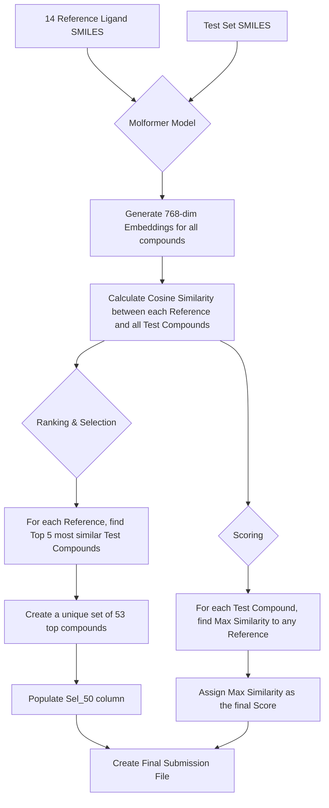

# DREAM CHALLENGE: TARGET 2035

## STEP 2: Ensemble Prediction and Embedding-based Closeness for WDR91 Hit Selection

[Authors]
Gautam Ahuja^*1,2^,  Rik Ganguly^*3^, Zonunmawia^2,4^, Bableen Kaur^2^,  Sagarika Toor^5^, Vinita Sharma^5^, Aakansha Rai^2^, Rintu Kutum^1,2,3,6,#^

[1] Department of Computer Science, Ashoka University
[2] Koita Centre for Digital Health - Ashoka (KCDH-A),  University
[3] Mphasis AI & Applied Tech Lab at Ashoka, Ashoka University
[4] International University of Applied Science, Bad Honnef, Germany
[5] Department of Biology, Ashoka University
[6] Trivedi School of Biosciences, Ashoka University  

[*] Equal contribution
[#] Corresponding author

## Methods

For Step 2, we prepared two distinct submissions based on different methodologies. The first approach is an extension of our Step 1 model, using the maximum probability from our ensemble. The second approach uses molecular embeddings and cosine similarity to identify compounds that are structurally similar to known reference ligands.

### Submission 1: Max-Probability Ensemble

This submission leverages the five XGBoost models trained during the 5-fold cross-validation in Step 1. The feature set and preprocessing steps remain identical.

1. **Model Ensemble Prediction**: The test data, processed with the same feature selection (top 500 most variable features from 9 fingerprint types) and scaling, was fed into each of the five trained XGBoost models.
2. **Max-Probability Scoring**: Unlike Step 1 where we averaged the probabilities, for this submission, the final "Score" for each compound was determined by taking the **maximum** predicted probability of being a "Hit" (class 1) from across the five models.
3. **Hit Selection**: The compounds were ranked based on this max-probability score, and the top 50 compounds were selected to populate the `Sel_50` column.

### Submission 2: Molformer Embedding Closeness

This approach moves away from fingerprint-based classification and instead focuses on the chemical similarity between test compounds and known reference ligands, measured in an embedding space.

1. **Molformer Embeddings**: We used a pre-trained Molformer model to generate 768-dimensional vector embeddings for each SMILES string in the test set and for the 14 provided reference WDR91 ligands. This process translates the chemical structure of each molecule into a dense numerical representation.

2. **Cosine Similarity**: To quantify the similarity between the test compounds and the reference ligands, we calculated the cosine similarity between the embedding of each of the 14 reference ligands and the embeddings of all compounds in the test set.

3. **Hit Selection (`Sel_50`)**:
    * For each of the 14 reference ligands, we identified the top 5 test compounds with the highest cosine similarity scores.
    * We then created a combined, unique list of these top compounds. This resulted in a set of 53 unique compounds that are most similar to the known ligands.
    * The `Sel_50` column in the submission file was marked as '1' for the top 50 of these 53 compounds (based on max similarity) and '0' for all others.

4. **Scoring**: The "Score" for every compound in the test set was determined by its **maximum** cosine similarity value when compared against all 14 reference ligands. This score represents how close a given test compound is to its nearest known ligand in the embedding space.

## Results

The two submission strategies yielded distinct sets of predictions and scores.

* **Max-Probability Ensemble Results**: This submission file contains predictions based on the highest confidence score from our ensemble of machine learning models. The `Sel_50` column highlights the 50 compounds our models deemed most likely to be hits with the highest conviction from at least one model in the ensemble.

* **Molformer Embedding Closeness Results**: This submission is based entirely on structural similarity to known active compounds. The `Sel_50` column identifies 50 compounds (of 53) that are closest to the 14 reference ligands in the Molformer embedding space. The score for each compound is a direct measure of this closeness (max cosine similarity), providing a transparent and interpretable ranking metric based on proximity to known binders.
